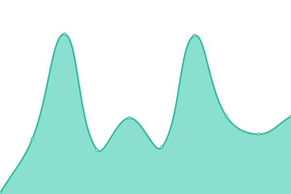
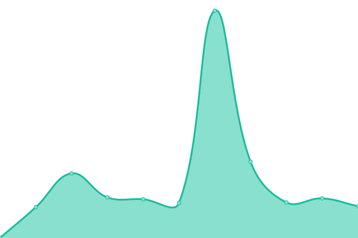

# [📈 Live Status](https://sergiosg.github.io/poc-uptime): <!--live status--> **🟩 All systems operational**

This repository contains the open-source uptime monitor and status page for [sergiosg](https://sergiosg.github.io/poc-uptime), powered by [Upptime](https://github.com/upptime/upptime).

With [Upptime](https://upptime.js.org), you can get your own unlimited and free uptime monitor and status page, powered entirely by a GitHub repository. We use [Issues](https://github.com/sergiosg/poc-uptime/issues) as incident reports, [Actions](https://github.com/sergiosg/poc-uptime/actions) as uptime monitors, and [Pages](https://sergiosg.github.io/poc-uptime) for the status page.

<!--start: status pages-->
<!-- This summary is generated by Upptime (https://github.com/upptime/upptime) -->
<!-- Do not edit this manually, your changes will be overwritten -->
<!-- prettier-ignore -->
| URL | Status | History | Response Time | Uptime |
| --- | ------ | ------- | ------------- | ------ |
|  [Reloadly Developer Portal](https://www.reloadly.com) | 🟩 Up | [reloadly-developer-portal.yml](https://github.com/sergiosg/poc-uptime/commits/HEAD/history/reloadly-developer-portal.yml) | 

 282ms
     
 | 

<a href="https://sergiosg.github.io/poc-uptime/history/reloadly-developer-portal">100.00%</a>
    

|  [Authorization Service](https://auth.reloadly.com) | 🟩 Up | [authorization-service.yml](https://github.com/sergiosg/poc-uptime/commits/HEAD/history/authorization-service.yml) | 

 135ms
     
 | 

<a href="https://sergiosg.github.io/poc-uptime/history/authorization-service">100.00%</a>
    

|  [Topups Service](https://topups.reloadly.com) | 🟩 Up | [topups-service.yml](https://github.com/sergiosg/poc-uptime/commits/HEAD/history/topups-service.yml) | 

 130ms
     
 | 

<a href="https://sergiosg.github.io/poc-uptime/history/topups-service">99.38%</a>
    

|  [Topups Sandbox Service](https://topups-sandbox.reloadly.com) | 🟩 Up | [topups-sandbox-service.yml](https://github.com/sergiosg/poc-uptime/commits/HEAD/history/topups-sandbox-service.yml) | 

 160ms
     
 | 

<a href="https://sergiosg.github.io/poc-uptime/history/topups-sandbox-service">100.00%</a>
    

|  [Giftcards Service](https://giftcards.reloadly.com) | 🟩 Up | [giftcards-service.yml](https://github.com/sergiosg/poc-uptime/commits/HEAD/history/giftcards-service.yml) | 

 133ms
     
 | 

<a href="https://sergiosg.github.io/poc-uptime/history/giftcards-service">100.00%</a>
    

|  [Giftcards Sandbox Service](https://giftcards-sandbox.reloadly.com) | 🟩 Up | [giftcards-sandbox-service.yml](https://github.com/sergiosg/poc-uptime/commits/HEAD/history/giftcards-sandbox-service.yml) | 

 136ms
     
 | 

<a href="https://sergiosg.github.io/poc-uptime/history/giftcards-sandbox-service">99.12%</a>
    

|  [Portal Service](https://portal2.reloadly.com) | 🟩 Up | [portal-service.yml](https://github.com/sergiosg/poc-uptime/commits/HEAD/history/portal-service.yml) | 

 194ms
     
 | 

<a href="https://sergiosg.github.io/poc-uptime/history/portal-service">100.00%</a>
    

|  [Google](https://www.google.com) | 🟩 Up | [google.yml](https://github.com/sergiosg/poc-uptime/commits/HEAD/history/google.yml) | 

 69ms
     
 | 

<a href="https://sergiosg.github.io/poc-uptime/history/google">100.00%</a>
    

<!--end: status pages-->

[**Visit our status website →**](https://sergiosg.github.io/poc-uptime)

## 📄 License

- Powered by: [Upptime](https://github.com/upptime/upptime)
- Code: [MIT](./LICENSE) © [sergiosg](https://sergiosg.github.io/poc-uptime)
- Data in the `./history` directory: [Open Database License](https://opendatacommons.org/licenses/odbl/1-0/)
